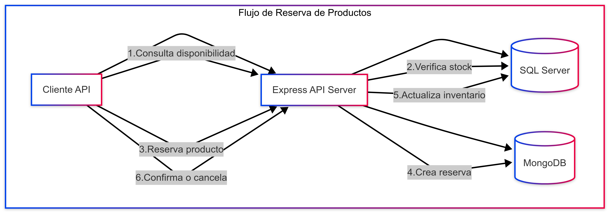

# Integration

# Retail Chain Integration API

Esta API demuestra la integración entre SQL Server y MongoDB para un sistema de gestión de cadenas minoristas. La aplicación gestiona productos, inventarios y reservas con una arquitectura que aprovecha las ventajas de ambas bases de datos.

## Arquitectura

La aplicación sigue una arquitectura de servicios y controladores para separar claramente las preocupaciones:

- **SQL Server**: Almacena datos transaccionales (productos, inventario, tiendas)
- **MongoDB**: Almacena datos no estructurados (preferencias de clientes, detalles extendidos de reservas)

### Diagrama de la Arquitectura



## Flujo Principal: Reserva de Productos

El flujo principal de la aplicación permite a los clientes reservar productos para recogerlos más tarde:

1. El cliente verifica la disponibilidad de productos
2. El sistema verifica el inventario en SQL Server
3. El cliente reserva un producto
4. Se crea un documento de reserva en MongoDB
5. Se actualiza el inventario en SQL Server
6. El cliente recibe un código de confirmación
7. El cliente puede confirmar, cancelar o completar la reserva

## Estructura del Proyecto

```
retail-integration-api/
├── controllers/            # Controladores HTTP
│   ├── inventory.controller.js
│   └── reservation.controller.js
├── databases/              # Conexiones a bases de datos
│   ├── mongoClient.js
│   └── sqlClient.js
├── models/                 # Modelos de datos
│   ├── mongoModels.js
│   └── sqlModels.js
├── routes/                 # Rutas de la API
│   ├── inventory.routes.js
│   └── reservation.routes.js
├── services/               # Lógica de negocio
│   ├── inventory.service.js
│   └── reservation.service.js
├── utils/                  # Utilidades
│   └── logger.js
├── .env                    # Variables de entorno
├── index.js                # Archivo principal
└── package.json            # Dependencias
```

## Configuración

1. Clona el repositorio
2. Instala las dependencias:
   ```
   npm install
   ```
3. Crea un archivo `.env` con las siguientes variables:
   ```
   PORT=3000
   SQL_USER=tu_usuario
   SQL_PASSWORD=tu_contraseña
   SQL_SERVER=tu_servidor
   SQL_DATABASE=RetailChainDB
   MONGO_URI=mongodb://localhost:27017/RetailChainDB
   ```

> **ℹ️ Nota:**  
> La conexión al cliente de SQL Server se realiza utilizando **autenticación de Windows**, por lo que se usó el driver [**MSNodeSQLv8**](https://www.npmjs.com/package/msnodesqlv8).
> También puedes ver más información en la [**documentación de mssql**](https://www.npmjs.com/package/mssql).  
> En este caso, las variables `SQL_USER` y `SQL_PASSWORD` **no serán necesarias**.  
>
> ❤️ *¡Happy coding!*


## Ejecución

Para iniciar el servidor en modo desarrollo:
```
npm run dev
```

Para iniciar el servidor en modo producción:
```
npm start
```

## Endpoints de la API

### Inventario (SQL Server)

- `GET /api/inventory`: Obtener todo el inventario
- `GET /api/inventory/stores/:storeId`: Obtener inventario de una tienda
- `GET /api/inventory/products/:productId`: Obtener inventario de un producto
- `GET /api/inventory/low-stock`: Obtener productos con bajo stock
- `GET /api/inventory/availability/:storeId/:productId`: Verificar disponibilidad
- `PUT /api/inventory/update/:storeId/:productId`: Actualizar inventario
- `GET /api/inventory/transactions/:storeId`: Obtener transacciones de inventario
- `POST /api/inventory/transfer`: Transferir inventario entre tiendas

### Reservas (MongoDB + SQL Server)

- `POST /api/reservations`: Crear una nueva reserva
- `GET /api/reservations/:code`: Obtener detalles de una reserva
- `PUT /api/reservations/:code/confirm`: Confirmar una reserva
- `PUT /api/reservations/:code/cancel`: Cancelar una reserva
- `PUT /api/reservations/:code/complete`: Completar una reserva
- `GET /api/reservations/active`: Obtener reservas activas
- `GET /api/reservations/customer/:customerId`: Obtener reservas de un cliente

## Documentación

La documentación completa de la API está disponible en la ruta `/api-docs` cuando el servidor está en ejecución.

## Ventajas de la Integración

Esta arquitectura híbrida aprovecha las fortalezas de cada base de datos:

1. **SQL Server**:
   - Integridad de datos para información crítica de inventario
   - Transacciones ACID para operaciones de actualización de stock
   - Relaciones complejas entre productos, tiendas e inventario

2. **MongoDB**:
   - Esquema flexible para datos de reserva y preferencias de clientes
   - Almacenamiento eficiente del historial de cambios de estado
   - Escalabilidad horizontal para datos que crecen rápidamente

## Ejemplo de Integración

Cuando un cliente crea una reserva:

1. Se verifica la disponibilidad en SQL Server
2. Se crea una reserva en MongoDB con detalles completos
3. Se actualiza el inventario en SQL Server
4. Si la reserva se cancela o expira, el inventario se actualiza nuevamente en SQL Server

Este flujo mantiene la integridad referencial mientras aprovecha la flexibilidad documental.
